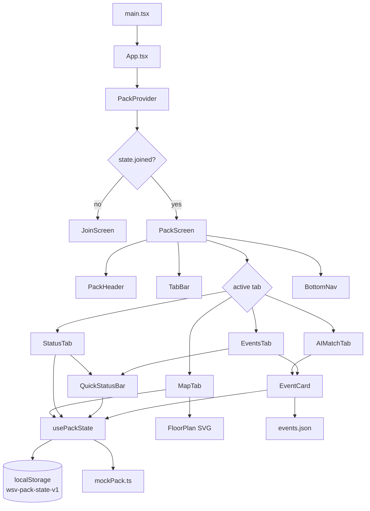

# AGENTS.md

Orientation for an AI coding agent picking this repo up cold. Read [README.md](README.md) first for the user-facing pitch; this file captures the **why behind the code** and the **conventions you must not break**.

---

## 1. What this is in one paragraph

A mobile-first Vite + React + TypeScript single-page app that demos a "pack coordination" feature on top of the Web Summit Vancouver experience. It is a **hackathon MVP** — every pack member, status, wishlist entry, AI recommendation and map pin is **mock data**. The UI is fully interactive (toggle bookmarks, broadcast statuses, refresh AI matches, move your map pin), but nothing hits a network. State is persisted to `localStorage` so the demo survives refreshes. Deployable to Vercel or GitHub Pages as static files.

The project brief lives at [websummit_hackathon.md](websummit_hackathon.md) — read it for the framing the user will reference when asking for changes.

---

## 2. Hard constraints (do not violate without asking)

1. **Mockup-first, static data.** Do not introduce Supabase, Claude API calls, or any other live backend unless the user explicitly asks. The reducer in [src/hooks/usePackState.ts](src/hooks/usePackState.ts) is the single intentional integration seam — replace it later, not now.
2. **Mobile aspect ratio on desktop.** [src/layout/MobileFrame.tsx](src/layout/MobileFrame.tsx) wraps the app in a 420 × 880 phone-shaped viewport with black gutters when the viewport is `≥ sm` (640px). On real mobile the app fills the screen. **Never** make the layout responsive in the "fill the desktop" sense — this is a phone-feature demo. The faux notch is intentional.
3. **No router.** The app uses state-based view switching (`state.joined` in `App.tsx`, `useState<TabId>` in `PackScreen.tsx`). This keeps deploys trivial on both Vercel and GitHub Pages. Don't add `react-router-dom` unless the user asks for deep links.
4. **Bottom nav: only "Pack" is enabled.** [src/layout/BottomNav.tsx](src/layout/BottomNav.tsx) deliberately disables Home / Schedule / Scan / Profile. The user picked this in planning to keep demo focus crystal clear. Don't "helpfully" make them clickable.
5. **The 4 sub-tabs match the user's mockup screenshots.** Events → Status → Map → AI Match. Their visual language (dark theme, brand purple `#7C5CFF`, format-coloured pills, rounded cards with a 1-pixel `border-line` border) is the demo's pixel-level reference. Use the existing palette tokens before adding new ones.
6. **Real event data only.** All event IDs in [src/data/mockPack.ts](src/data/mockPack.ts) reference real entries in `events.json` (515 sessions, scraped). When adding a new mock wishlist entry or AI match, look up a real event ID first — the cards pull title, time, location, speakers, and description from the JSON.
7. **`base: "./"` in [vite.config.ts](vite.config.ts) is load-bearing** for GitHub Pages. Don't change it.

---

## 3. Architecture at a glance



**Data flow:** mock seed data (`mockPack.ts`) → `useReducer` in `PackProvider` → context → components. Mutations go back through `usePackState()` actions (`join`, `leave`, `broadcast`, `toggleWishlist`, `moveUser`, `refreshAiMatches`). The reducer auto-syncs to `localStorage` after every change.

---

## 4. Where to look first for common tasks

| If the user asks to…                                  | Edit these files                                                                                                                       |
| ----------------------------------------------------- | -------------------------------------------------------------------------------------------------------------------------------------- |
| Change a member's name, avatar, or interests          | `MEMBERS` in [src/data/mockPack.ts](src/data/mockPack.ts)                                                                            |
| Add / remove events from the curated wishlist         | `WISHLIST` in [src/data/mockPack.ts](src/data/mockPack.ts) — use real IDs from `events.json`                                         |
| Change a status preset, its label or icon             | `STATUS_PRESETS` in [src/data/mockPack.ts](src/data/mockPack.ts) and `ICONS` map in [QuickStatusBar.tsx](src/features/pack/QuickStatusBar.tsx) + [StatusTab.tsx](src/features/pack/StatusTab.tsx) |
| Reposition pre-set member pins on the map             | `INITIAL_MAP_POSITIONS` in [src/data/mockPack.ts](src/data/mockPack.ts) (0–100 % of the SVG viewBox)                                 |
| Add new named zones for "Pick zone" sheet             | `MAP_ZONES` in [src/data/mockPack.ts](src/data/mockPack.ts)                                                                          |
| Add / tweak AI match recommendations                  | `AI_MATCH_SETS` in [src/data/mockPack.ts](src/data/mockPack.ts) — two sets, "Refresh Matches" rotates between them                   |
| Change the join code                                  | `PACK_CODE` in [src/data/mockPack.ts](src/data/mockPack.ts) and the placeholder copy in [JoinScreen.tsx](src/screens/JoinScreen.tsx) |
| Recolour a summit format's pill                       | `FORMAT_COLORS` in [src/utils/events.ts](src/utils/events.ts)                                                                          |
| Adjust the venue floor plan illustration              | SVG paths in [src/features/pack/FloorPlan.tsx](src/features/pack/FloorPlan.tsx)                                                      |
| Edit the brand palette                                | `theme.extend.colors` in [tailwind.config.js](tailwind.config.js)                                                                      |
| Adjust mobile frame dimensions or notch               | [src/layout/MobileFrame.tsx](src/layout/MobileFrame.tsx)                                                                               |

---

## 5. Mock data conventions

- **Member roster.** 5 logical members live in `MEMBERS`: `you`, `daniel`, `jessica`, `ramesh`, `zohaib`. `OTHER_MEMBER_IDS` is the 4 friends excluding `you`. The header displays "N / 6 IN PACK" using `MEMBER_LIMIT = 6`, with the 4 friends shown as avatar circles and a "+" to invite more.
- **The user is "You", not a fifth profile.** "You" appears in feeds and on the map, but the avatar row in `PackHeader` only shows the 4 friends. Overlap counts in `EventCard` are denominated `N / 4` (other members), with a separate filled-bookmark icon to indicate whether `you` are also going. Don't conflate these two signals.
- **Event IDs.** All wishlist and AI-match entries reference real IDs in `events.json`. If you invent an ID, the card will render nothing because `getEvent(id)` returns `undefined`.
- **Day labels.** `dayLabel()` in [src/utils/time.ts](src/utils/time.ts) returns 3-letter codes ("MON", "TUE", "WED", "THU") computed from the event's `date` field. The conference spans 2026-05-11 → 2026-05-14. There is **no "FRI"** in the real data despite the mockup using it for one card — that was illustrative.
- **Times are local Vancouver time.** Event ISO strings encode the local time with a `-07:00` offset; `formatClock()` parses the `HH:MM` portion directly to avoid UTC drift. Don't replace it with `new Date().toLocaleTimeString()` — that will print the user's local time instead of Vancouver time.

---

## 6. Styling conventions

- **Palette** is in `tailwind.config.js`. Use these tokens, not raw hex:
  - Backgrounds: `bg-app` (black), `bg-card` (`#15151A`), `bg-card-muted`, `bg-card-elevated`
  - Borders: `border-line` (`#26262E`)
  - Text: `text-ink`, `text-ink-muted`, `text-ink-subtle`
  - Brand: `text-brand-light`, `bg-brand`, `bg-brand-tint`, `ring-brand`
- **Component classes** in [src/index.css](src/index.css):
  - `.card` — the standard rounded dark card with a 1px line border
  - `.pill` — uppercase tiny tag (used for format chips, BETA badge, MEMBERS label)
  - `.tap` — `transition active:scale-[0.98]` for touch feedback
- **Format pill colours** are looked up by `formatPillClasses(format)` in [src/utils/events.ts](src/utils/events.ts). When you add a new format, add a row there.
- **Icons** are all from `lucide-react`. Stick to it for visual consistency.

---

## 7. State model (`usePackState`)

The reducer in [src/hooks/usePackState.ts](src/hooks/usePackState.ts) holds:

```ts
type PackState = {
  joined: boolean;
  wishlist: Record<eventId, MemberId[]>;
  statusFeed: StatusEntry[]; // newest first
  mapPositions: Record<MemberId, { x: number; y: number }>;
  aiMatchSetIndex: number; // index into AI_MATCH_SETS
};
```

Actions:
- `JOIN` / `LEAVE` — `LEAVE` re-seeds from `mockPack.ts` (effective reset for the demo)
- `BROADCAST` — prepends a "You" entry to `statusFeed`, removes the previous user entry, bumps every other entry's `minutesAgo` by 1
- `TOGGLE_WISHLIST` — flips "you" in the goers list for an event
- `MOVE_USER` — repositions the user's map pin
- `REFRESH_AI` — `(aiMatchSetIndex + 1) % AI_MATCH_SETS.length`
- `HYDRATE` — used internally to restore from `localStorage` on mount

The storage key is `wsv-pack-state-v1`. **Bump the suffix if you change the shape** so old localStorage doesn't break new builds.

`PackProvider` is the only sane way to mount the app. `usePackState()` throws if called outside it.

---

## 8. Build, dev, deploy

```bash
npm install
npm run dev       # http://localhost:5173/
npm run build     # tsc -b && vite build → dist/
npx vite preview  # smoke-test the built dist/
```

- The build typechecks first (`tsc -b`). Lints clean as of writing.
- `events.json` is bundled into the JS chunk (~870 KB raw, ~237 KB gzipped). This is intentional — conference WiFi is unreliable, so offline-first matters more than initial-bundle size. Vite emits a 500 KB chunk warning; ignore it.
- Vercel: zero config. `vercel.json` declares an SPA fallback so any deep path serves `index.html`.
- GitHub Pages: `vite.config.ts` already sets `base: "./"`. Publish `dist/`.

---

## 9. Environment quirks (Windows / PowerShell)

The original development environment is Windows + PowerShell. A few things to know:

- **`&&` doesn't chain commands** in older PowerShell. Use `;` or run commands separately.
- **`npm run preview -- --port 4173` is broken** under PowerShell — `npm` swallows the `--` and Vite sees `4173` as a positional arg, which trips a "directory 'dist' does not exist" error. Use `npx vite preview --port 4173` instead, or just `npm run preview` (defaults to port 4173).
- **`npm run build` writes a chunk-size warning to stderr** which PowerShell surfaces as `node.exe : At C:\Program Files\nodejs\npm.ps1:29 char:3 ...`. This is **not** a failure — check the exit code (0) and look for `✓ built in …` above the noise.
- **`curl` is an `Invoke-WebRequest` alias** and doesn't understand `-s`, `-o`, etc. Use `Invoke-WebRequest -UseBasicParsing` directly.

---

## 10. Quick recipes for common follow-ups

### Add a new tab to the Pack screen
1. Add an entry to `TABS` in [src/features/pack/TabBar.tsx](src/features/pack/TabBar.tsx) and extend the `TabId` union.
2. Create a `NewTab.tsx` component in `src/features/pack/`.
3. Wire it into the `tab === "..."` switch in [src/screens/PackScreen.tsx](src/screens/PackScreen.tsx).

### Wire the AI Match button to a real Claude API
1. Add `VITE_ANTHROPIC_API_KEY` (or proxy through a Vercel Edge Function — Anthropic shouldn't be called from the browser directly).
2. Replace `currentAiMatches` derivation in [src/hooks/usePackState.ts](src/hooks/usePackState.ts) with an async fetch keyed off `state.wishlist` and the member tags.
3. Keep the `AI_MATCH_SETS` fallback for offline/demo mode — the user values offline-resilience.

### Make the prototype multiplayer
The reducer in `usePackState.ts` is intentionally the only place that needs to change. Swap the storage adapter for a Supabase channel that mirrors `PackState`. UI components don't need to know.

### Add a new status preset
1. Append to `STATUS_PRESETS` in [src/data/mockPack.ts](src/data/mockPack.ts) (and extend the `StatusPresetId` union).
2. Add icon + tint entries in `ICONS` ([QuickStatusBar.tsx](src/features/pack/QuickStatusBar.tsx)) and `ICON_MAP` + `TINT_MAP` ([StatusTab.tsx](src/features/pack/StatusTab.tsx)).
3. Update `cycleNext()` ordering in `StatusTab.tsx` so the Broadcast Status button still cycles correctly.

### Replace pravatar avatars with custom photos
Drop images into `public/avatars/`, then set each `Member.avatar` in `mockPack.ts` to `"./avatars/daniel.jpg"` etc. The relative path works under `base: "./"`.

---

## 11. Project source map (one-liners)

```
src/
  main.tsx React root
  App.tsx Provider + Join/Pack view switch
  index.css Tailwind + .card / .pill / .tap
  vite-env.d.ts
  data/
    events.json 515 scraped sessions (bundled)
    mockPack.ts ALL demo content lives here
  hooks/
    usePackState.ts Reducer + Context + localStorage
  utils/
    events.ts Typed event helpers + format colour map
    time.ts Day labels, clock, relative time
  layout/
    MobileFrame.tsx Desktop phone frame
    BottomNav.tsx 5-tab nav (only Pack enabled)
  screens/
    JoinScreen.tsx Landing with pre-filled WSV7XK
    PackScreen.tsx Header + tab content + nav shell
  features/pack/
    PackHeader.tsx Title, Leave, join code card, packmates row
    TabBar.tsx Events | Status | Map | AI Match
    EventsTab.tsx Overlap list + browse-all mode
    StatusTab.tsx Live status + activity feed
    MapTab.tsx Floor plan + pins + tap/zone update
    AIMatchTab.tsx Top-3 picks with reasoning
    EventCard.tsx Shared overlap card + bookmark
    FilterSheet.tsx Format filter bottom sheet
    QuickStatusBar.tsx 5 preset broadcast pills
    FloorPlan.tsx Stylised SVG of the convention centre
```

Config: `package.json`, `vite.config.ts`, `tsconfig.json`, `tsconfig.node.json`, `tailwind.config.js`, `postcss.config.js`, `vercel.json`, `index.html`.
